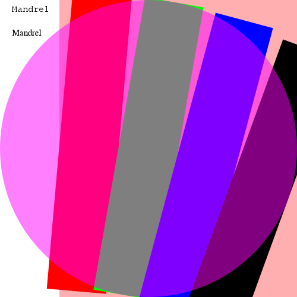

# ImageIO/AWT Smoke test

The purpose of this test app is to carry out some
simple Java2D steps and to generate images, including an SVG one using JFree SVG.
Ordinary tasks one might want to do in a backend app, including loading a custom font.


The test also performs some color space conversions, and it decodes JPEG 2000 format.


Images are generated during runtime. Their correctness is ascertained by checking their hashsums.

This is a preview of what the expected, full colour, transparency enabled image looks like. Note that other generated formats
do not support transparency or are just monochrome bitmaps.



## Failures

Apart from checking logs for errors and warnings, the test suites also checks that all expected
files are generated. If it fails, this is what it looks like:

```
[ERROR] Failures: 
[ERROR]   AppReproducersTest.imageioAWTTest:210 There were errors checking the generated image files, see:
mytest.wbmpX was not generated.
mytest.bmp's sha256 hash was ec29663c7be2fbebd39be4fcea1ca18e81c2e0f31d92f73b3907c47c9f59aa1e, expected hash: ec29663c7be2fbebd39be4fcea1ca18e81c2e0f31d92f73b3907c47c9f59aa1eX ==> expected: <true> but was: <false>
[INFO] 
[ERROR] Tests run: 1, Failures: 1, Errors: 0, Skipped: 0
```